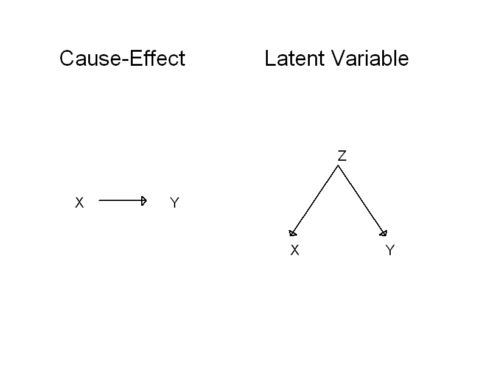

---
header-includes:
   - \usepackage{color}
output:
  pdf_document:
    fig_caption: no
  html_document: default
---

```{r, echo=FALSE, warning=FALSE, message=FALSE}
whichcomp <- strsplit(getwd(),"/")[[1]][3]
load(paste0("c:/users/", whichcomp, "/Dropbox/teaching/Resma3/Resma3.RData"))
require(knitr)
require(ggplot2)
require(grid)
```
`r hl()$basefontsize()`

<style>
table, th, td { text-align:right; }
th, td {padding: 10px;}
</style>

#Correlation vs. Causation

Say we have found  correlation between variables "x" and "y". How can we understand and interpret that relationship?

**Toy Example** 

  x = Number of fireman responding to a fire 

  y = damages done by the fire. 

  say there is a positive correlation between x and y (and in real live there will be!) 

  does this mean x causes y? 


  
Please note saying `r hl()$fontcolor("x causes y")` is not the same as `r hl()$fontcolor("x determines y")`. There are usually many other factors besides x that influence y, maybe even some more important than x. For example say x="Time studied for Exam" and y="Score on Exam". Let's assume that there is a positive correlation between x and y. It is reasonable to conclude that x causes y, that is studying longer improves the scores. But of course there are also many other factors such as general ability, previous experience, being healthy on the day of the exam, exam anxiety, having a hang-over etc. 

`r hl()$vs()`

Confusing correlation with causation can sometimes lead to very strange conclusions:

[Bizzare Correlations](http://www.buzzfeed.com/kjh2110/the-10-most-bizarre-correlations)

but the real danger are cases were ther is no causation but it is not so obvious. In fact trying to determine whther an observed correlation is due to causation is one of the genuinely hard problems in Statistics:

###Case Study:  Smoking and Lung Cancer

There have been hundreds of studies all over the world that have shown a correlation between smoking rates and lung cancer deaths, usually with correlations of about 0.5 to 0.7. And yet, none of these studies has shown that smoking causes lung cancer because all of the were observational studies, not clinical trial. 

The only perfectly satisfactory way to establish a causation is to find a random sample, for example to do a **clinical trial**. An **observational study** is always somewhat suspect because we never know about hidden biases. Nevertheless, even only using observational studies the evidence for cause-effect can be quite strong:
Things to look for when trying to establish a causation:

-  correlation is strong - the correlation between smoking and lung cancer is very strong
  

-  correlation is consistent over many experiments - many studies of different kinds of people in different countries over a long time period all have shown this correlation

-  higher doses are associated with stronger responses - people who smoke more have a higher chance of lung cancer

-  the cause comes before the response in time - lung cancer develops after years of smoking. The number of men dying of lung cancer rose as smoking became more common, with a lag of about 30 years. Lung cancer kills more men than any other form of cancer. Lung cancer was rare among women until women started to smoke. Lung cancer in women rose along with smoking, again with a lag of about 30 years, and has now passed breast cancer as the leading cause of cancer deaths among women.

-  the cause is plausible - lab experiments on animals show that nicotin causes cancer.

This issue goes by the name of "Correlation does not imply Causation", but it is not specific to quantitative data (where we use the word "correlation"), it comes up anytime we compare two variables:

**Example** Rogaine: we rejected the null hypothesis of no relationship between the treatment (Rogaine or Placebo) and hair growth. Does this mean Rogaine causes hair to grow?
There is nothing in the statistical analysis that says so, but because this was a clinical trial with random assignments to treatment and control there can be no latent variable, so the answer is yes.

**Example** Mothers and Cocain use: we rejected the null hypothesis of no relationship between the drug use of the mother and the length of the babies. Does this mean the drug use is the cause for the difference? 

Again there is nothing in the statistical analysis that says so, and this was an observational study, so there is the possibility of a latent variable. It is difficult to imagine what that would be, though.
 
 
