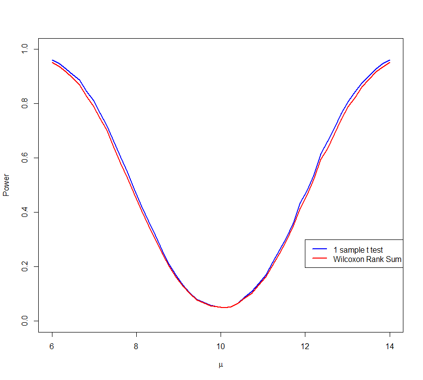

<style>
table, th, td { text-align:right; }
th, td {padding: 10px;}
</style>

```{r, echo=FALSE, warning=FALSE, message=FALSE}
whichcomp <- strsplit(getwd(),"/")[[1]][3]
load(paste0("c:/users/", whichcomp, "/Dropbox/Resma3/Resma3.RData"))
library(knitr)
opts_chunk$set(fig.width=6, fig.align = "center", 
      out.width = "70%", warning=FALSE, message=FALSE)
library(ggplot2)
library(grid)
```
`r hl()$basefontsize()`

#Non-Normal Residuals, No Equal Variance - Non-Parametric Methods 


##One Quantitative Variable (Alternative to 1 Sample t) 


###Case Study: Euro Coins

Data set: **euros**  
say we are told that a one euro coin is supposed to weigh 7.5 grams. Does the data in support that claim?

The boxplot of Weight shows severe outliers, so the usual 1 sample t test won't work. Unfortunately the log transfromations does not work here either:

```{r}
attach(euros)
head(euros)
bplot(Weight)
bplot(log(Weight))
```

This is not a surprise, by the way, because the outliers are on both sides of the box.

So, what now? For this situation we have a set of methods called **non-parametric**, which make no assumptions, especially not the one of the 1 sample t test, namely normal distribution. The name of the test that works here is **Wilcoxon Signed Rank Test**.
 
The details are
```{r}
one.sample.wilcoxon(Weight, med.null=7.5)  
```

1) Parameter of interest: 1 median  
2) Method of analysis: Wilcoxon Signed Rank test   
3) Assumptions of Method: **none**  
4) $\alpha$ = 0.05   
5) Null hypothesis H~0~: M=7.5 (median weight is 7.5 grams)   
6) Alternative hypothesis H~a~: M $\ne$ 7.5 (median weight is not 7.5 grams)   
7) p value = 0.000  
8) 0.000<0.05, so we reject H~0~, it seems the median weight is not 7.5 grams.

Actually, in this data set we could still have used the usual 1-sample t test (also with a p-value of 0.000) because we have a very large sample (n=2000), but in general it is never clear exactly how large a sample needs to be to "overcome" some outliers, so these non-parametric tests are always a safe alternative. 

####Why not always use the non-parametric test?

 If using the t test sometimes is wrong but the Wilcoxon Rank Sum test always works, why not just always use this test and be safe? The answer is that the t test has a larger power: 
 


In real life the  power of the nonparametric tests is often almost as high as the power of the standard tests, so they should always be used if there is a question about the normal assumption. 

The arguments of the *one.sample.wilcoxon* routine are the same as those of the *one.sample.t* command. For example if we wanted to test 

5) Null hypothesis H~0~: M=7.5 (median weight is 7.5 grams)   
6) Alternative hypothesis H~a~: M>7.5 (median weight is higher than 7.5 grams)

we could run

```{r}
one.sample.wilcoxon(Weight, med.null=7.5, alternative = "greater")  
```

If we wanted a 90% confidence interval for median we could use

```{r}
one.sample.wilcoxon(Weight, conf.level=90, ndigit=4)  
```


##Categorical - Quantitative (Alternative to ANOVA) 


###Case Study: Euro Coins

Say we want to know whether the coin in the 8 different rolls have the same average weight. The non-parametric alternative to the oneway ANOVA is  the **Kruskal-Wallis test:**

```{r}
kruskalwallis(Weight, Roll) 
```

1) Parameters of interest: **medians**  
2) Method of analysis: Kruskal-Wallis  
3) Assumptions of Method: **none**  
4) $\alpha$ = 0.05  
5) Null hypothesis H~0~: M~1~=..=M~8~ (group **medians** are the same)  
6) Alternative hypothesis H~a~: M~i~ $\ne$ M~j~ for some i, j(group medians are not the same)  
7) p value = 0.00  
8) 0.00 < 0.05, so we reject H~0~, it seems the group medians are not the same  

###Case Study: Cultural Differences in Equipment Use

A US company manufactures equipment that is used in the production of semiconductors. The firm is considering a costly redesign that will improve the performance of its equipment. The performance is characterized as mean time between failures (MTBF). Most of the companies customers are in the USA, Europe and Japan, and there is anectotal evidence that the Japanese customers typically get better performance from the users in the USA and Europe.

Data: MTBF for randomly selected users in the USA, Europe and Japan.

Data set: **culture**

```{r}
attach(culture)
head(culture)
table(Country)
bplot(MTBF, Country)
```
  
There is a problem with the normal assumption. We can try to fix this with the log transform, but as we can see again this does not work:

```{r}
bplot(log(MTBF), Country)
```
  
**Summary Statistics**

We could not even find a transformation, so we will use the median and IQR:
```{r}
stat.table(MTBF, Country, Mean=FALSE)
```

Because none of the transformations worked we will use the non-parametric Kruskall-Wallis test:

```{r}
kruskalwallis(MTBF, Country)
```

1) Parameters of interest: medians  
2) Method of analysis: Kruskal-Wallis  
3) Assumptions of Method: **none**  
4) $\alpha 0.05$   
5) Null hypothesis H~0~: M~1~ = M~2~ = M~3~ (group medians are the same)  
6) Alternative hypothesis H~a~: M~i~ $\ne$ M~j~ for some i, j (group medians are not the same)  
7) p value = 0.001  
8) 0.001 < 0.05, so we reject H~0~, it seems the group medians are not the same, the MTBF is different in diffferent countries 

If we had just done the ANOVA Country would not have been stat. significant (p-value = 0.098) but if you remember to check the normal plot you will see that there is a problem with this analysis.


##Quantitative - Quantitative

If the transformations fail in a regression problem things become very tricky, and far beyond the scope of this class. Talk to a professional!


```{r, echo=FALSE}
detach(euros)
detach(culture)
```
