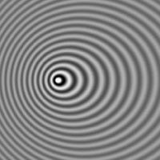
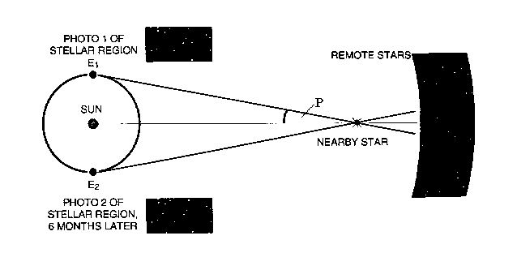

<style>
table, th, td { text-align:right; }
th, td {padding: 10px;}
</style>

```{r, echo=FALSE, warning=FALSE, message=FALSE}
whichcomp <- strsplit(getwd(),"/")[[1]][3]
load(paste0("c:/users/", whichcomp, "/Dropbox/Resma3/Resma3.RData"))
library(knitr)
opts_chunk$set(fig.width=6, fig.align = "center", 
      out.width = "70%", warning=FALSE, message=FALSE)
library(ggplot2)
library(grid)
```
`r hl()$basefontsize()`

#Hypothesis Tests in SLR

###Case Study: Hubble's Constant


In 1929 Edwin Hubble published a paper showing a relationship between the distance and radial velocity away from Earth of "extra-galactic nebulae" (galaxies).  His findings revolutionized astronomy. The "Hubble constant," the slope of the regression of velocity (Y) on distance (X), is still a subject of research and debate.  
The data here are those Hubble published in his original paper. It also has data from much more recent studies.

```{r}
head(hubble)
```

The data set has the variables **Velocity** and **Distance**. Here is some info on these:

###Velocity

Velocity (Speed with a sign) is measured in km/sec. How can one measure the speed with which a galaxy moves relative to earth? This is done using the **Doppler Effect**:



For more on the Doppler Effect go to [Doppler Effect](http://en.wikipedia.org/wiki/Doppler_effect)

###Distance

The unit of distance in our dataset is one **Megaparsec**, or 1 million parsecs. A parsec is equal to 3.262 light years, or 19.17 billion miles. Here are some astronomical distances for illustration:

- Earth to Moon: 240000 miles (or 1.3 light seconds)  
- Earth to Sun: 92 million miles (or 8.2 light minutes)  
- Earth to nearest Solar System (Alpha Centauri): 8.37 billion miles (or 4.365 light years or 1.338 parsec)  
- Earth to nearest galaxy (Andromeda): 48000 million million miles (or 2.5 million light years or 740 000 parsec or 0.7 megaparsec)  

How does one measure the distance of a galaxy (or a star)? It is done using a method called **parallax**:  



For more on parallax go [here](href="http://www.ast.cam.ac.uk/~mjp/parallax.html)

```{r}
attach(hubble) 
splot(Velocity, Distance)
```

The scatterplot of Velocity by Distance shows a strong relationship.

```{r}
slr(Velocity, Distance, show.tests = TRUE)
```
  
The two graphs show us that the assumptions of LSR are justified.
Let's discuss the next part of the output:

- Constant: p = 0.6298  
- Distance: p = 0  

Whenever there is a p value, there is a hypothesis test. Here there are two. The first one is for the

##Constant:
$$
\begin{aligned}
&H_0: \beta_0 = 0 \text{  (intercept is zero)}  \\
&H_a: \beta_0 \ne 0 \text{   (intercept is not zero)}
\end{aligned}
$$
If we fail to reject $H_0$, we conclude that the constant is not statistically significantly different from 0 (at the sample size of the data set!).

If we reject $H_0$, we conclude that the constant is statistically significantly different from 0.

Consequences:  

We are fitting the model 
$$
y=\beta_0+\beta_1x
$$
If H~0~ is true then $\beta_0=0$, so the model becomes 
$$
y=\beta_1x
$$
this is called a **no-intercept** model. To get this model we have to rerun the regression:

```{r fig.show='hide'}
slr(Velocity, Distance, no.intercept=TRUE)
```

The slope of the line **423.9** is called Hubble's constant and is one of the fundamental constants in the universe! 
  
**Note** the slope of the no intercept model (423.9) is NOT the same as the slope of the regular model (454.2) 

**Note** The decision whether an intercept should be fit or not is best made based on the background of the data and whether if x=0 then y=0 makes sense.

One consequence of this model is that if x=0 then 

$$
y=\beta_1x=\beta_1 0=0
$$
so the point (0,0) is **always** on this line.

**Example** Say we have data with x = Number of Hurricanes in a year and y = $ Amount of Damage done by the Hurricanes. Now if x=0 (there were no hurricanes) obviously y=0 (no damage), so a no-intercept model is appropriate (even if the corresponding hypothesis test says otherwise!)

##Predictor:
$$
\begin{aligned}
&H_0: \beta_1 = 0 \text{  (slope is zero)}  \\
&H_a: \beta_1 \ne 0 \text{   (slope is not zero)}
\end{aligned}
$$
Consequences:  our model is 
$$
y=\beta_0+\beta_1x
$$
If $H_0$ is true then $\beta_1 =0$, so the model becomes 
$$
y=\beta_0+0x=\beta_0
$$
But there is no more predictor x here! So if we fail to reject $H_0$ it means that the predictor has no statistically significant relationship with the response (at least not for the sample size of the dataset).

If we do reject $H_0$ we conclude that there is a statistically significant relationship between predictor and the response y.

**Note** in a simple regression model such as we have here this test is the same as the test for Pearson's correlation coefficient.

##Hubble data:

**Constant:**  

1) Parameter: Intercept in SLR  
2) Method: SLR  
3) Assumptions: same as SLR  
4) $\alpha = 0.05$  
5) $H_0: \beta_0 = 0$ (intercept is zero)  
6) $H_a: \beta_0 \ne 0$ (intercept is not zero)  
7) $p = 0.6298$  
8) $p > \alpha$, so we fail to reject the null hypothesis, the constant is stat. consistent with 0 (at the sample size of the dataset)

**Distance:**

1) Parameter: Slope in SLR  
2) Method: SLR  
3) Assumptions: same as SLR   
4) $\alpha = 0.05$   
5) $H_0: \beta_1 = 0$ (slope is 0, no relationship between distance and velocity)   
6) $H_a: \beta_1 \ne 0$ (slope is not 0, some relationship between distance and velocity)   
7) p = 0.000   
8) $p < \alpha$, so we reject the null hypothesis, there is a statistically significant relationship between velocity and distance.

##What are these tests good for?
Notice that when I ran the least squares regression command

```{r, eval=FALSE}
slr(Velocity, Distance, show.tests = TRUE)
```

I added the argument show.tests = TRUE. Without it these tests would not be done. That is because in many ways they are useless!

- whether or not a no-intercept model is what we want should be decided by our understanding of the experiment, not the outcome of the the test for the constant 

- the test for the slope is the same as Pearson's correlation test, which we likely already did!

I have discussed them here because you will see them in real live and so you should know what they are.

##What it all means
What are the consequences of all this for our understanding of the universe?


```{r, echo=FALSE}
detach(hubble)
```
